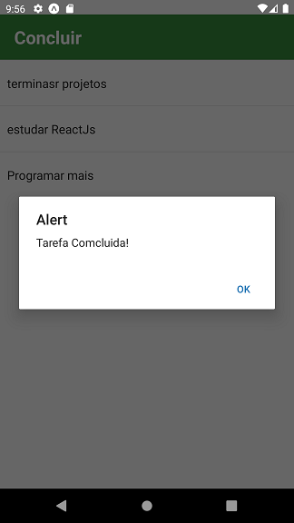
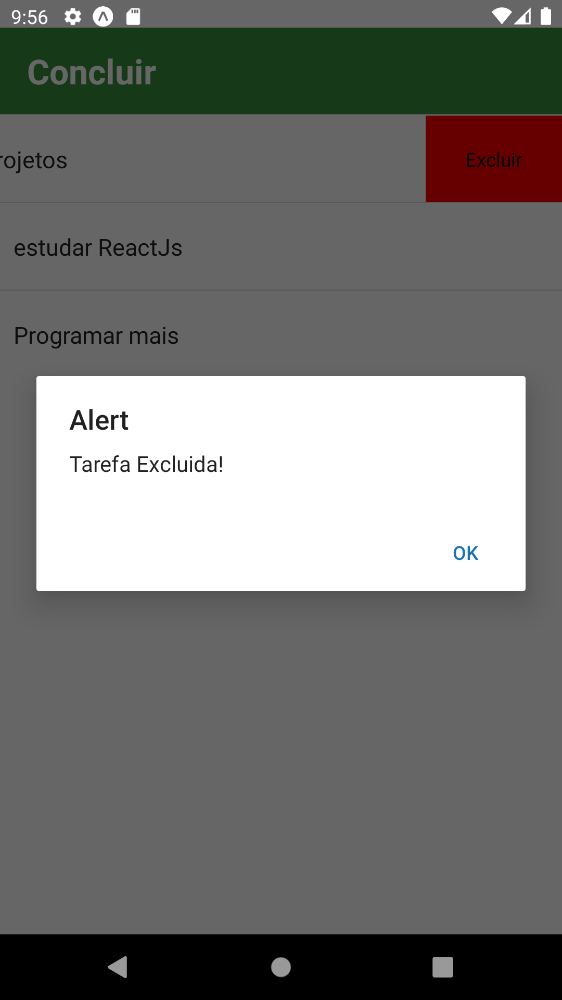

# SwipeList-ReactNative-EXPO

#### Estudo de como fazer uma lista com os efeitos de arrastar para o lado e aparecendo opções no caso apenas comcluir e exclui utilizando alguns recursos de efeitos, estou utilizando o expo no projeto

## Imagens do projeto
### Somente a lista

### Quando arrata tudo da esquerda para direita

### Quando arrasta da direta para a esquerda querendo excluir

### Quando clica no botão de excluir

## Como usar:
1. Abra o projeto 
2. Use: "npm install" para baixar os node_modules
3. Depois use: "expo start" 

## Conteudo desse estudo
* JavaScript
* gesture-handler/Swipeable
* Array Fake para as listas
* Animações nos textos
